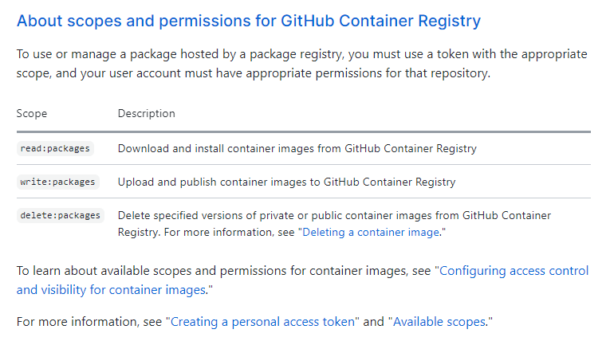
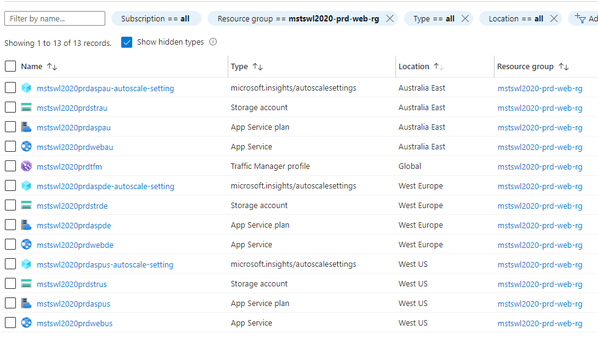
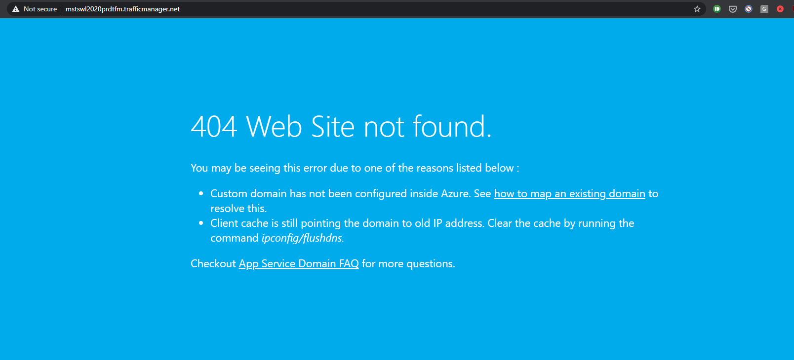

# Azure Festive Tech Hackathon Deployment Automation 2020 Submission

  

Submission for Day3 Deployment Automation Challenge https://hackathon.cloudadventures.org/

if you prefer images you can zoom in, you may also read this content in my blog too: [link](https://mertsenel.tech/project/azure-multi-region-scalable-web-architecture/)

Table of Contents
=================

* [Architecture](#Architecture)
* [Technologies Used](#Technologies-Used)
* [How to Deploy](#How-to-Deploy)
  * [Deployment Requirements](#Deployment-Requirements)
  * [Recommended](#Recommended)
  * [Setting Up Your Repository](#Setting-Up-Your-Repository)
    * [Creating Personal Access Token For GitHub Container Registry](#Creating-Personal-Access-Token-For-GitHub-Container-Registry)
    * [Creating Azure Credentials to be used in GitHub Actions](#Creating-Azure-Credentials-to-be-used-in-GitHub-Actions)
    * [Pre-Deployment Steps](#Pre-Deployment-Steps)
      * [Project Naming Legend](#Project-Naming-Legend)
      * [Updating the parameters file](#Updating-the-parameters-file)
   * [Deployment Steps](#Deployment-Steps) 
    * [Build and Push the Docker Container Image](#Build-and-Push-the-Docker-Container-Image) 
    * [Deploy Azure Infrastructure and Use the website](#Deploy-Azure-Infrastructure-and-Use-the-website) 
      * [If you get this Error Page](#If-you-get-this-Error-Page) 
    * [How to Add A New Country to the Architecture (Optional)](#How-to-Add-A-New-Country-to-the-Architecture-(Optional)) 
* [How to Clean Up the Azure Resources](#How-to-Clean-Up-the-Azure-Resources)
* [Hackathon Requirements Checklist](#Hackathon-Requirements-Checklist)
* [Acknowledged / Out of Scope Issues](#Acknowledged-/-Out-of-Scope-Issues)

## Architecture


## Technologies Used

__Docker__ - Containerized the application [Dockerfile](/source/Dockerfile)

If we deploy the published binaries directly to our servers, we need to be able to dynamically update our deployment task in our pipeline. 

Docker containers allows us to build once, push to a feed (container registry) and instruct our compute components to pull the docker image and run the artifacts within the container. 

I've picked the build inside the container approach with the .NET 5.0 SDK and publish the final image based on the runtime container image.

__GitHub__
Source repository for our project.

__GitHub Packages(GitHub Container Registry)__ [Link](https://github.com/features/packages)
After Docker Hub imposing public pull rate limits I was looking for an alternative for personal projects and GitHub Packages(GitHub Container Registry) seems like the perfect candidate. It's free for public repositories and I wanted to test it out, hence I have decided to use this service.

__GitHub Actions__ [Link](https://github.com/features/actions)
GitHub Actions is also chosen due to it's convenience. Having the CI/CD automation directly with code and also in GitHub is very nice for projects like this. Once you fork the repository you immediately setup your pipelines too, how awesome is that.

__Microsoft Azure__
__Azure Resource Manager (ARM) templates__
Microsoft Azure's native Infrastructure as Code language. I am familiar with it so I have picked it to deploy and configure the infrastructure. 

It has the necessary 'copy' (looping) logic which allows us to deploy to multiple regions with ease. 

It also has the ability to read runtime values such as access keys to storage accounts. 

This is how I configure the App Services AppSettings with connectionString parameter for the desired region. 

This way all the secrets that needs to be passed and configured to our App Services are handled during the Infrastructure deployment. 

__Azure App services__
Reliable Azure PaaS service to host web based services in a highly available and scalable infrastructure. 

__Traffic Manager__
In order to handle geo-routing requirement without code changes, this is a Azure IaaS service that allows us to do DNS based geo-routing. 

__Azure Monitor Auto-Scale for App Service Plans__
Azure Monitor has auto-scaling capabilities for Azure App Service Plans. As our requirement was to handle increasing demand, Ive gone with a processor based performance metric to setup the scale-out/in rule logic. 

## How to Deploy

### Deployment Requirements

1. Azure CLI (tested with v2.7.0) [Link](https://docs.microsoft.com/en-us/cli/azure/install-azure-cli)
2. Powershell Core (tested with v7.1.0) [Link](https://docs.microsoft.com/en-us/powershell/scripting/install/installing-powershell?view=powershell-7.1)
3. Az Powershell Module (tested with v4.8.0) [Link](https://docs.microsoft.com/en-us/powershell/azure/new-azureps-module-az?view=azps-5.2.0)

### Recommended

1. Visual Studio Code [Link](https://code.visualstudio.com/)
2. Azure Resource Manager (ARM) Tools Extension [Link](https://marketplace.visualstudio.com/items?itemName=msazurermtools.azurerm-vscode-tools)

### Setting Up Your Repository

To start with, you need an active Azure account to be able to deploy this project.

1. Fork this repository

2. Opt-In for (GitHub Container Registry) [For Further Info](https://docs.github.com/en/free-pro-team@latest/packages/guides/about-github-container-registry)

From top-right corner in GitHub's web interface click on your profile picture and then Feature preview


3. And click the enable button. Mine is already enabled so I can only show you the disable button :) You just need to take my word for it, and click the button that says __Enable__. 


And don't worry as long as you keep your repository as Public, GitHub Packages is __free__ for Public repositories, at least as of writing this. You can find most-up to date information from [https://github.com/features/packages](https://github.com/features/packages)


So why not make use of it.

Once you enabled your GitHub Container Registry, we need to create a credential for our GitHub Actions Workflows to be able to push our Docker container image to the registry. 

We need to create a personal access token that has enough permissions to authenticate to our personal docker container registry aka GitHub Container Registry.

The official documentation for creating a Personal Access Token:
[https://docs.github.com/en/free-pro-team@latest/github/authenticating-to-github/creating-a-personal-access-token](https://docs.github.com/en/free-pro-team@latest/github/authenticating-to-github/creating-a-personal-access-token)

I've provided above for your reference you can also follow along the guide. 

#### Creating Personal Access Token For GitHub Container Registry

1. Go to your profile Settings

2. Go to Developer Settings

3. Click on Generate new token button

4. Select "write:packages" scope 


This is explanation of why this scope is required from GitHub's documentation:

Documentation for GitHub Container Registry Personal Access token Requirements
[https://docs.github.com/en/free-pro-team@latest/packages/guides/about-github-container-registry#about-scopes-and-permissions-for-github-container-registry](https://docs.github.com/en/free-pro-team@latest/packages/guides/about-github-container-registry#about-scopes-and-permissions-for-github-container-registry)

5. Click Generate new token


6. You will see your access token generated. This is a secret and you should treat it as such. You can click on the clipboard icon to copy value to you clipboard but don't lose it as it will be only shown to you one time. Save it in a safe temporary place for now. We will need it in the next steps. Dont worry we will save it in a long term secret vault soon. 


7. Go back to your Repository Settings and Secrets Tab

Click on New repository secret button


Name your secret __"CR_PAT"__ (This is important as our workflows are expecting a variable name with this name) and put in the access token value as the secret value. Click on Add Secret button.


8. That's it, now let's generate our Azure Credentials too so we can deploy our Infrastructure to Azure.

#### Creating Azure Credentials to be used in GitHub Actions

We are using Azure Login GitHub Action in your workflows and their official instructions for generating secrets are below: 
Link: [https://github.com/marketplace/actions/azure-login#configure-deployment-credentials](https://github.com/marketplace/actions/azure-login#configure-deployment-credentials)

Because our workflow will create/remove resource groups and provision resources it requires Contributor rights in the subscription scope. 

I've already created a helper script you can use the generate your Azure credentials.
You can find: [here](/operations/pipeline/prerequisites/Generate-GHActionAzureCredentials.ps1)

__Generate-GHActionAzureCredentials.ps1__

```powershell
<#
    This Script will generate a Service Principal to be used in Azure Login Github Action as a Secret 
#>
[CmdletBinding()]
param (
    [Parameter()]
    [string]
    $SpnName="santatech-web-deploy-spn",
    # Parameter help description
    [Parameter()]
    [string]
    $EnvironmentVariableName = 'AZURE_CREDENTIALS'
)
# Create Service Principal with Az Cli as it already generates a Secret and able to print out result in SDK expected format
# See this link for more information https://github.com/marketplace/actions/azure-login
$SPNCreds = az ad sp create-for-rbac --name $SpnName --sdk-auth --role contributor

# Save the SPN Credentials to a local file so you can use it to create your Github Repository Secret
$SPNCreds | Set-Content -Path "./$EnvironmentVariableName.json" -Force
```

1. Run the script as below


The script will create a Service principal, save the credential json file to your local as **"AZURE_CREDENTIALS.json"**. Don't worry the file is gitignored so it won't be uploaded to your GitHub repository.

2. Once you have the json file generated, copy and paste the contents of that file as your **"AZURE_CREDENTIALS"** Github Repository Secret.


3. at the end your secrets should look like this


4. Ok now we are getting closer. Only couple more hoops left. 

#### Pre-Deployment Steps

Project Deployment Automation is a little opinionated and follows the below naming pattern. 

Because most of the Azure Services we are using are Platform As a Service offerings, they come with a built-in public DNS record for direct availability. hence each resource name is also a DNS address, so we need to adhere to certain naming limitations. 

In order to take out the hard work on your end, all you have to decide is a __Project__ Code and an __Environment__ prefix, because we are very close to __Christmas__ I am going directly to __Production__ and below project code is my unique codename for this project.

>Tip:Append either __project__ or __env__ with some numerical values (i.e. 01, 02, 03) for easy name uniqueness.

##### Project Naming Legend

__Project Details__  
Project Name: __Mert Senel Tech - Santa Tech Wish List 2020__
Project ShortCode(Prefix): __mstswl2020__

| Environments     |     Code       |
| ------------- |:-------------:|
| Production | prd |

| Santa WishList Services    |     Resource Group Name       |
| ------------- |:-------------:|
| All Resources  |  {projCode}-{env}-web-rg |

Curated Resource Group Name: __mstswl2020-prd-web-rg__

| Azure Resources     |     Code       |
| ------------- |:-------------:|
| App Service Plan    | asp      |
| Web App    | web  |
| Storage Account     | str      |
| Traffic Manager Profile | tfm |

Countries table is a sample subset of what is available, you can use any Azure Region you want. Please check out this link for the full list. [Click Here](https://docs.microsoft.com/en-us/azure/traffic-manager/traffic-manager-geographic-regions)

| Country   |     Azure Region      | Country Short Code |
| ------------- |:-------------:|:-------------:|
| United States  |  West US     | US |
| Germany  | West Europe    | DE |
| Australia |  Australia East | AU |

| Project Resources | Naming Convention          |
| ------------- |:-------------:|
| App Service Plan | {projCode}{env}asp{rgn}  |
| Auto Scale Settings | {projCode}{env}asp{rgn}-autoscale-setting  |
| Web App  | {projCode}{env}web{rgn}  |
| Storage Account       | {projCode}{env}str{rgn}  |
| Traffic Manager Profile  | {projCode}{env}tfm |

__Resources Generated Sample:__


If you've decided on your __project__ or __env__  values we just need to find which Country code your country belongs to. Our project will deploy to multiple regions based on provided input but make sure one of those countries is where you are accessing internet. This way you will be routed to your regional app service and you can test your deployment.

Go to link below and find your Country Code: 
[https://docs.microsoft.com/en-us/azure/traffic-manager/traffic-manager-geographic-regions](https://docs.microsoft.com/en-us/azure/traffic-manager/traffic-manager-geographic-regions)

I live in __Australia__ so for me it's __AU__

Now go to this link [https://azure.microsoft.com/en-au/global-infrastructure/geographies/#overview](https://azure.microsoft.com/en-au/global-infrastructure/geographies/#overview)
and find an Azure Region that is in your Country.

If you don't have an Azure Region you can pick the closest to you. This will define where the Azure resources will be deployed. However, the first Country code will be used in geo-routing so it needs to match your country of internet access.

I've picked __Australia East__ as my Australian Azure region.

##### Updating the parameters file

1. By now you should have a __project__ code, an __env__ prefix code, your Country Code and Azure Region that country code should be mapped to. 

For satisfying the requirements, the architecture should have at least 2 regions so we can test geo-routing. 

2. My parameter file has 2 regions set in it, Germany (DE) and Australia (AU), 
So update this section with your __Country Code__ and __Azure Region__ you've chosen.  


```json
 "Locations": {
            "value": [{
                    "AzureLocation": "West Europe",
                    "CountryCode": "DE"
                },
                {
                    "AzureLocation": "Australia East",
                    "CountryCode": "AU"
                }
            ]
        },
```

3. We also need to update the value for __dockerImageName__ parameter. 
Update the middle section with your own username lowercased. 

> My GitHub username is: 'MertSenel' but the expected value there is 'mertsenel'

4. This is the parameters file snippet with values for you to fill. 
__/operations/ARM/web/mstswl2020.web.parameters.json__
```json
{
    "$schema": "https://schema.management.azure.com/schemas/2019-04-01/deploymentParameters.json#",
    "contentVersion": "1.0.0.0",
    "parameters": {
        "project": {
            "value": "#{UPDATE-WITH-YOUR-PROJECT-CODE}#" 
        },
        "env": {
            "value": "#{UPDATE-WITH-YOUR-ENV-PREFIX}#"
        },
        "ProjectRGLocation": {
            "value": "West Europe",
            "metadata": {
                "description": "Azure Region to Create the Project Resource Group in, used by the deployment scripts, this won't change where actual infrastructure will be deployed to",
                "reference": "To see which Azure Regions are available and hosted in which Country visit: https://azure.microsoft.com/en-au/global-infrastructure/geographies/"
            }
        },
        "Locations": {
            "value": [{
                    "AzureLocation": "#{UPDATE-WITH-YOUR-AZURE-REGION}#",
                    "CountryCode": "#{UPDATE-WITH-YOUR-COUNTRY-CODE}#"
                },
                {
              "AzureLocation": "#{UPDATE-WITH-SECONDARY-AZURE-REGION}#",
                    "CountryCode": "#{UPDATE-WITH-SECONDARY-COUNTRY-CODE}#"
                }
            ]
        },
        "dockerImageName": {
            "value": "ghcr.io/#{UPDATE-WITH-YOUR-GITHUB-USERNAME-LOWERCASE}#/santatechwishlist"
        },
        "HostingPlanSkuConfig": {
            "value": {
                "Tier": "PremiumV2",
                "Name": "P1v2"
            }
        },
        "autoscaleEnabled": {
            "value": true
        }
    }
}
```

save the file once you are done commit and push to your repository. We are now ready to build and deploy __Santa Tech Wish List__

### Deployment Steps

#### Build and Push the Docker Container Image

1. From your repositories Actions tab, find the __Build And Publish Docker Image__ workflow and click on Run workflow button. 


2. Wait for your build to finish.


3. Make sure it finished without any errors as below: 


4. Now go to your GitHub Profile and __Packages__ tab.


as you can see our docker image is pushed but currently, it's private. We need to make it public so our Azure App Services can also be able to access it.

5. Click on the package name to open up it's details and click on __Package Settings__


6. Click on Make Public and then follow through the instructions to make the package public. 


7. You should end up with this result. Where the __private__ label is now gone. 


#### Deploy Azure Infrastructure and Use the website

1. From your repositories Actions tab, find the __Deploy Azure Resources__ workflow and click on Run workflow button.


2. You should expect to see a similar run log output to below:


the pipeline should output the deployed Traffic manager address where you can reach your regional Santa Tech Wish List instance. 

3. In my case the url was __http://mstswl2020prdtfm.trafficmanager.net__ let's visit and see if it all worked. 


4.Yes it works, at least we can see the website, lets see if it's functional.
Let's first fill in the form. 


5. Add it to the list


6. and Finally submit our wish. 


7. If we did everything right, my wish should end up in the Australia Region Storage Account.
You should be able to find your wish in your picked Azure region you decide to route your country code. 

and we can see my wish in the Australia Storage Account


8. As you can see each app service plan also deploys with a coupled auto-scale settings


Azure monitor will track our App Service Plan Processor Usage Average Metric and will Scale-Out and Scale-in as configure upon meeting scale rule conditions. Below is how it would look on Azure Portal. 


This will handle increasing and dynamic capacity requirement to our web server infrastructure.

##### If you get this Error Page

I've occasionally came across this issue where Traffic Manager does not successfully add it's domain name to app services, hence app service rejects the request with Host header "mstswl2020prdtfm.trafficmanager.net"


See below where "mstswl2020prdtfm.trafficmanager.net" custom domain binding is missing.


If this happens, just run the __Deploy Azure Resources__ GitHub Actions workflow again and the problem should be resolved on it's own. 

See below where "mstswl2020prdtfm.trafficmanager.net" custom domain binding is added after 2nd deployment.


You should end up with above state. 

#### How to Add A New Country to the Architecture (Optional)

One of the requirements was to have the automation, be able to handle adding a new countries without requiring huge manual effort. Hence, I've structured my template around this requirement. 

Here is how to add a third or N'th Country to our Architecture.

1. Update the parameters file and add a new array element to Locations array as seen below.


2. Save the file commit and push to your GitHub repository.


4. Run the __Deploy Azure Resources__ Workflow again to create the new region. As ARM templates are declarative you can deploy them multiple times and existing resources will continue functioning the same way as long as there are no changes or them in the deployment template. 


5. This time you should also see some logs regarding to the new region added, in our case "US" region. 


6. We Can now see the resources deployed for United States deployed to West US region. 


7. And here is the dynamically generated geo-routing endpoint for the country. 


8. Lets see the details of the endpoint. We can see that it is filtering for United States.


9. To test is temporarily I'm changing it to route whole World into this region. 


10. I will connect to the website again via Opera browsers built-in VPN from "Americas" region. Because I'm not sure which country this VPN infrastructure is exactly using I've changed the setting to "World" in step 9.
If you have another VPN solution, you may not need this step. 


11. Lets make another submission and this wish should end up in the newly created US storage account.


12. And yes, we can see our wish again generated with right family name and location.


13. How easy was that, we've just appended some array and clicked a button and just like magic, we are now in business in a whole another country. 

## How to Clean Up the Azure Resources

After testing your deployment, make sure the delete the Resource Group to avoid incurring costs to your Subscription. Auto-Scaling and Traffic Manager Geo-Routing requires at least Standard or Premium SKU plans for App Service Plan, hence they will be somewhat costly. I suggest you deploy, demo/test and remove the resources as soon as possible. 


1.  From your repositories Actions tab, find the __Remove Azure Resources__ workflow and click on Run workflow button.


2. You should see a similar output to below:


3. Check Azure Portal and you should now see all the resource and the resource group removed. 


>Tip for Advanced readers: There is also another parameters file in repository called __mstswl2020.web.parameters.poc.json__ that file will deploy the App Service Plan as F1/Free SKU. The traffic manager won't work but you can test changes to your template, script, CICD etc. by using that. It will deploy just fine and you can test the app services individually, it will take away the biggest cost component of the architecture, the Premium App Service Plans.

## Hackathon Requirements Checklist


- [x] __Website hosting and scaling__
The solution needs to be deployed on Microsoft Azure. The Website needs to scale keep up with the growing number of children wanting to send in their wish list.

Solution satisfies this requirement by using auto-scaling Azure App Services per each Country deployed.

- [x] __Personalization__
For each country Santa would like to personalize the page. As he is not looking for code changes or implementing multi tenancy.

Each country has their own dedicated instance of the web application. The ARM template can be further extended to also pass in the region code such as AU, US, DE etc. to the App Service as an AppSetting.  

This way Application can be further customized based on this code to implement country based personalization. As code changes are out of scope, I'll leave it here. 

- [x] __Data compliance__
Data needs to be protected and preferably stored in the country that the 
children are living in.

This requirement is satisfied by our solution as each App Service will have the connectionString details for their respective region, the storage account where the user is living in will be used and user's data will be stored in their countries.

- [x] Remember, we’re not looking for code changes in the website itself. Santa is perfectly fine with deploying resources for each country as long as it doesn’t happen __manually__ and turn into a __repetitive point and click adventure__ in the __Azure Portal__.

As demonstrated above, expanding into a new country is very easy with this solution. All you need to do is to update the parameters file and the copy logic inside the ARM template will handle the rest. 

## Acknowledged / Out of Scope Issues

1. To be able to have end to end HTTPS we need to use a custom domain name. 
In order to not further complicate the solution, and it's not one of the submission requirements, I'm only drawing attention to this matter. 

As, having a domain name registration involves payments and some processes to go through, this may not be of reach to everyone. Hence left out from this solution. In real world, you would be securing the traffic end to end HTTPS (encrypted).

2. The App Services should be better complemented with an Application Gateway so the direct access to the app services are restricted. By not using the trafficmanager url and bypassing it, the app services are still available for direct access via their built-in DNS hostnames which is not ideal. 

For cost considerations, I decided to leave this out as well. As we are paying premium for the App Service Plans to satisfy another core-requirement which is auto-scaling. 
